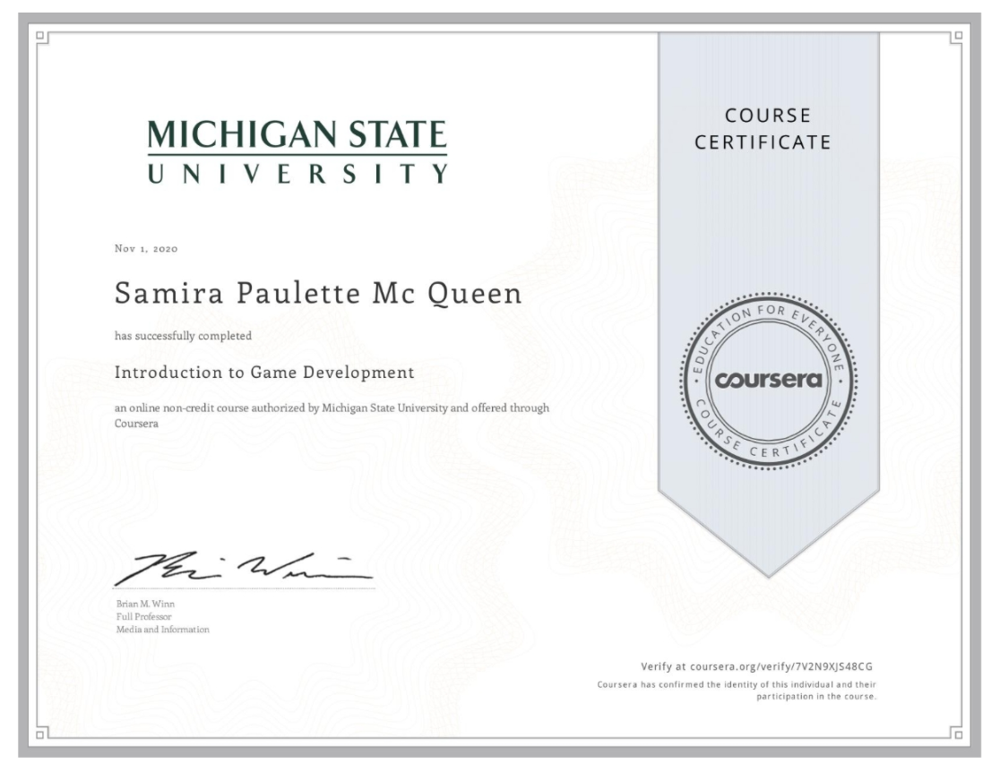

# Introduction to Game Development
This project was done in my Coursera Specialization Course

# Box Shooter
Unity built shooting game, with countdown time and beat level

Player has a certain amount of time to shoot as much boxes to reach to the other level

# About the Author
Name: Samira Mc Queen
[LinkedIn](https://www.linkedin.com/in/samira-mc-queen-1882431a7/)

Free Spririted Caribbean Woman.
Software Developer and aspiring Game Developer

# Project 

## Experience with Project
- This was my 3rd project while doing the course and i've been loving it
- Creating this game became challenging at first as the course was progressing and getting deeper into the langauge and the Unity platform

# Game Features
- Two levels
- Player has the option to play again or to go to the next level once the first level is beat
- Player can shoot
- Player gets bonus time when hitting the light blue boxes

# Language
- C Sharp

# Platform
- Unity

# Game Play
First download the repository locally on your device
- For Mac go to this part of the project and run the game 
``
(box-shooter/Build/Mac/Mac-Build.app/)
``

Enjoy! :) 
